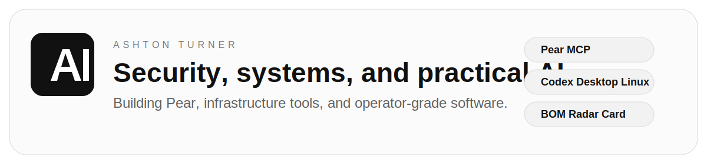

<!--
This repository appears on the GitHub profile for AshtonAU.
Keep it sharp, current, and biased toward real work over badges.
-->

  <picture>
    <source media="(prefers-color-scheme: dark)" srcset="./assets/header-dark.svg">
    
  </picture>

  <a href="https://ashton.com.au">site</a>
  ·
  <a href="https://ashton.com.au/blog">blog</a>
  ·
  <a href="https://pearmcp.com">pear</a>
  ·
  <a href="https://x.com/AshtonAU">x</a>
  ·
  <a href="https://www.linkedin.com/in/ashtonturner/">linkedin</a>

I build practical tools across infrastructure, security, and AI systems. Previously at Google and Apple. Now independent, shipping products like Pear and Codex Desktop for Linux, writing about the weird corners of AI tooling, and taking on selected technical work.

## Featured Projects

- [Pear](https://pearmcp.com)  
  Local iCloud MCP server for Calendar, Reminders, and Contacts.  
  [Write-up](https://ashton.com.au/blog/pear-mcp) · [Plugin repo](https://github.com/AshtonAU/pear-plugin)

- [Codex Desktop for Linux](https://github.com/AshtonAU/codex-desktop-linux)  
  Unofficial Linux wrapper for the OpenAI Codex desktop app, with stable and beta channel support.

- [BOM Radar Card](https://github.com/AshtonAU/bom-radar-card)  
  Home Assistant custom card for Australian Bureau of Meteorology radar tiles. No API key required.

- [Writing](https://ashton.com.au/blog)  
  Notes on AI tooling, infrastructure, security, and internet rabbit holes.  
  [Pear post](https://ashton.com.au/blog/pear-mcp) · [Codex beta guide](https://ashton.com.au/blog/how-to-find-and-install-the-latest-codex-beta-on-macos) · [RSS](https://ashton.com.au/rss.xml)

## What I Work On

- AI systems, local tooling, and the unglamorous integration work that makes them actually usable
- Security research, bug bounty work, and operational cleanup
- Infrastructure and automation across cloud, self-hosted, and day-to-day developer workflows

## Work With Me

I take on selected consulting across AI systems, infrastructure, security, and technical problem-solving.

[Services](https://ashton.com.au/services) · [LinkedIn](https://www.linkedin.com/in/ashtonturner/)

## Elsewhere

[GitHub](https://github.com/AshtonAU) · [X](https://x.com/AshtonAU) · [LinkedIn](https://www.linkedin.com/in/ashtonturner/)
